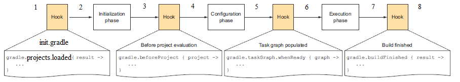

## gradle
官网: https://gradle.org
参考书:《实战gradle》
### 1.install
https://gradle.org/install
#### 1.1 要求
java版本8以上
```bash
$ java -version
java version "17.0.4.1"
```

#### 1.2 安装
##### 1.2.1 下载
去下载自己喜欢的版本 https://gradle.org/releases
##### 1.2.2 解压
```bash
$ mkdir /opt/gradle
$ unzip -d /opt/gradle gradle-7.5.1-bin.zip
$ ls /opt/gradle/gradle-7.5.1
LICENSE  NOTICE  bin  getting-started.html  init.d  lib  media
```
##### 1.2.3 配置PATH
```bash
 $ export PATH=$PATH:/opt/gradle/gradle-7.5.1/bin
 ```
##### 1.2.4 验证
```bash
$ gradle -v

------------------------------------------------------------
Gradle 7.5.1
------------------------------------------------------------
```

### 2.常用Command-Line Interface
https://docs.gradle.org/current/userguide/command_line_interface.html
gradle [taskName...] [--option-name...]
一些option的形式 `--console=plain`用`=`设置值；`--build-cache`开启cache，用`--no-build-cache`关闭cache; 用`-h`简写形式代替`--help`
运行task
```bash
gradle taskname 
gradle task1 task2 # 执行多个task
gradle task1 --exclude-task task2 # 在task执行链上，exclude一个task，可以用-x代替--exclude-task
gradle init # 初始化一个gradle项目
gradle clean # 清空build目录
gradle classes # 编译业务代码和配置文件
gradle test # 编译测试代码，生成测试报告
gradle build # 构建项目
```
使用`gradle tasks`查看所有可执行的task
<html xmlns="http://www.w3.org/1999/xhtml">
<body>
<pre>
<span style="font-weight:bold;">$ gradle tasks</span>
<span style="font-weight:bold;">&gt; Configure project :</span>
config helloworld task


<span style="font-weight:bold;">&lt;-------------&gt; 0% EXECUTING [32ms]</span><span style="font-weight:bold;">&gt; :tasks</span>
<span style="font-weight:bold;">&gt; Task :tasks</span>

<span style="font-weight:bold;">------------------------------------------------------------</span>
<span style="font-weight:bold;">Tasks runnable from root project 'hello-world'</span>
<span style="font-weight:bold;">------------------------------------------------------------</span>

<span style="font-weight:bold;">Build Setup tasks</span>
<span style="font-weight:bold;">-----------------</span>
<span style="color:green;">init</span><span style="color:olive;"> - Initializes a new Gradle build.</span>
<span style="color:green;">wrapper</span><span style="color:olive;"> - Generates Gradle wrapper files.</span>

<span style="font-weight:bold;">Help tasks</span>
<span style="font-weight:bold;">----------</span>
<span style="color:green;">buildEnvironment</span><span style="color:olive;"> - Displays all buildscript dependencies declared in root project 'hello-world'.</span>
<span style="color:green;">dependencies</span><span style="color:olive;"> - Displays all dependencies declared in root project 'hello-world'.</span>
<span style="color:green;">dependencyInsight</span><span style="color:olive;"> - Displays the insight into a specific dependency in root project 'hello-world'.</span>
<span style="color:green;">help</span><span style="color:olive;"> - Displays a help message.</span>
<span style="color:green;">javaToolchains</span><span style="color:olive;"> - Displays the detected java toolchains.</span>
<span style="color:green;">outgoingVariants</span><span style="color:olive;"> - Displays the outgoing variants of root project 'hello-world'.</span>
<span style="color:green;">projects</span><span style="color:olive;"> - Displays the sub-projects of root project 'hello-world'.</span>
<span style="color:green;">properties</span><span style="color:olive;"> - Displays the properties of root project 'hello-world'.</span>
<span style="color:green;">resolvableConfigurations</span><span style="color:olive;"> - Displays the configurations that can be resolved in root project 'hello-world'.</span>
<span style="color:green;">tasks</span><span style="color:olive;"> - Displays the tasks runnable from root project 'hello-world'.</span>

To see all tasks and more detail, run <span style="font-weight:bold;">gradle</span><span style="font-weight:bold;"> </span><span style="font-weight:bold;">tasks --all</span>

To see more detail about a task, run <span style="font-weight:bold;">gradle</span><span style="font-weight:bold;"> </span><span style="font-weight:bold;">help --task &lt;task&gt;</span>

<span style="font-weight:bold;color:green;">BUILD SUCCESSFUL</span> in 521ms
1 actionable task: 1 executed


<span style="font-weight:bold;">&lt;-------------&gt; 0% WAITING</span><span style="font-weight:bold;">&gt; :tasks</span></pre>
</body>
</html>

### 3.gradle wrapper

```bash
gradle wrapper
> Task :wrapper

BUILD SUCCESSFUL in 0s
1 actionable task: 1 executed
```
将当前的gradle打包到gradle/wrapper/gradle-wrapper.jar，其他下载这个项目的人就能使用你我们相同的gradle版本构建项目。当然，我们需要把这个jar包放到版本控制库中。
详情见：https://docs.gradle.org/current/userguide/gradle_wrapper.html#sec:adding_wrapper

### 4.构建生命周期

#### 4.1构建有三个独立的阶段
##### 4.1.1 初始化阶段
gradle支持单项目和多项目的构建。在初始化阶段，gradle决定要构建哪些项目，同时为每一个项目创建一个`Project`实例。
##### 4.1.2 配置阶段
这个阶段会配置project对象。执行所有的构建脚本。
##### 4.1.3 执行阶段
执行gradle命令指定的task(s)。这些task在配置阶段已经被创建并配置了。

#### 4.2 settings file
gradle除`build.gradle`还定义了默认名字为`settings.gradle`的文件，脚本会在初始化阶段执行。多项目的构建的根项目必须含有`settings.gradle`文件，子项目会继承根项目的`settings`。单项目的构建可以没有这个文件。

#### 4.3 初始化
gradle是怎么知道你的项目是单项目还是多项目的呢？目录下的`settings.gradle`会配置多项目的构建。Gradle还允许从参与构建的任何子项目中执行构建。如果你在子项目里（不包含`settings.gradle`）执行gradle，gradle会通过以下方式寻找`settings.gradle`文件：
1. 在父目录找
2. 如果没找到，作为单项目构建
3. 如果找到了，gradle会检查当前项目是否是`settings.gradle`的多项目中的一员。如果不是，就作为单项目构建。如果是，就作为多项目构建。

如果当前项目有`settings.gradle`，那么如果它没有定义`multi-project hierarchy`就会视为单项目。gradle会为每一个项目创建一个`project`对象。对于多项目构建，这些`project`在`setting`对象中指定。每个`project`的`name`默认是它的顶层目录名，除了`root project`外的`project`外的对象都有一个`parent project`。每一个`project`都有`child projects`。
<html><body><pre>
<span style="font-weight:bold;color:blue;">.</span>
├── build.gradle
├── <span style="font-weight:bold;color:blue;">hello-world</span>
│   ├── build.gradle
│   ├── log
│   └── settings.gradle
├── <span style="font-weight:bold;color:blue;">imgs</span>
│   ├── <span style="font-weight:bold;color:green;">build_lifecircle.png</span>
│   └── <span style="font-weight:bold;color:purple;">the_wrapper_flow.png</span>
├── <span style="font-weight:bold;color:blue;">java-plugin</span>
│   ├── a
│   ├── b
│   └── build.gradle
├── README.md
├── settings.gradle
└── <span style="font-weight:bold;color:blue;">wrapper-study</span>
    ├── build.gradle
    ├── <span style="font-weight:bold;color:blue;">gradle</span>
    │   └── <span style="font-weight:bold;color:blue;">wrapper</span>
    │       ├── <span style="font-weight:bold;color:red;">gradle-wrapper.jar</span>
    │       └── gradle-wrapper.properties
    ├── <span style="font-weight:bold;color:green;">gradlew</span>
    └── gradlew.bat
</pre></body></html>
在根目录的settings.gradle中引入`hello-world`子项目

```groovy
include "hello-world"
```
然后在根目录执行
```bash
gradle tasks --all
```
<html xmlns="http://www.w3.org/1999/xhtml">
<head>
<meta http-equiv="Content-Type" content="application/xml+xhtml; charset=UTF-8"/>
<title>stdin</title>
</head>
<body>
<pre>

<span style="font-weight:bold;">&lt;-------------&gt; 0% CONFIGURING [18ms]</span>
<span style="font-weight:bold;">&gt; Configure project :hello-world</span>
config helloworld task

<span style="font-weight:bold;">&gt; Task :tasks</span>
hello gradle!!
This is also executed during the configuration phase, because :configured is used in the build.
This is executed during the configuration phase as well, because :testBoth is used in the build.

<span style="font-weight:bold;">------------------------------------------------------------</span>
<span style="font-weight:bold;">Tasks runnable from root project 'gradle'</span>
<span style="font-weight:bold;">------------------------------------------------------------</span>

<span style="font-weight:bold;">Build Setup tasks</span>
<span style="font-weight:bold;">-----------------</span>
<span style="color:green;">init</span><span style="color:olive;"> - Initializes a new Gradle build.</span>
<span style="color:green;">wrapper</span><span style="color:olive;"> - Generates Gradle wrapper files.</span>

<span style="font-weight:bold;">Help tasks</span>
<span style="font-weight:bold;">----------</span>
<span style="color:green;">buildEnvironment</span><span style="color:olive;"> - Displays all buildscript dependencies declared in root project 'gradle'.</span>
<span style="color:green;">hello-world:buildEnvironment</span><span style="color:olive;"> - Displays all buildscript dependencies declared in project ':hello-world'.</span>
<span style="color:green;">dependencies</span><span style="color:olive;"> - Displays all dependencies declared in root project 'gradle'.</span>
<span style="color:green;">hello-world:dependencies</span><span style="color:olive;"> - Displays all dependencies declared in project ':hello-world'.</span>
<span style="color:green;">dependencyInsight</span><span style="color:olive;"> - Displays the insight into a specific dependency in root project 'gradle'.</span>
<span style="color:green;">hello-world:dependencyInsight</span><span style="color:olive;"> - Displays the insight into a specific dependency in project ':hello-world'.</span>
<span style="color:green;">help</span><span style="color:olive;"> - Displays a help message.</span>
<span style="color:green;">hello-world:help</span><span style="color:olive;"> - Displays a help message.</span>
<span style="color:green;">javaToolchains</span><span style="color:olive;"> - Displays the detected java toolchains.</span>
<span style="color:green;">hello-world:javaToolchains</span><span style="color:olive;"> - Displays the detected java toolchains.</span>
<span style="color:green;">outgoingVariants</span><span style="color:olive;"> - Displays the outgoing variants of root project 'gradle'.</span>
<span style="color:green;">hello-world:outgoingVariants</span><span style="color:olive;"> - Displays the outgoing variants of project ':hello-world'.</span>
<span style="color:green;">projects</span><span style="color:olive;"> - Displays the sub-projects of root project 'gradle'.</span>
<span style="color:green;">hello-world:projects</span><span style="color:olive;"> - Displays the sub-projects of project ':hello-world'.</span>
<span style="color:green;">properties</span><span style="color:olive;"> - Displays the properties of root project 'gradle'.</span>
<span style="color:green;">hello-world:properties</span><span style="color:olive;"> - Displays the properties of project ':hello-world'.</span>
<span style="color:green;">resolvableConfigurations</span><span style="color:olive;"> - Displays the configurations that can be resolved in root project 'gradle'.</span>
<span style="color:green;">hello-world:resolvableConfigurations</span><span style="color:olive;"> - Displays the configurations that can be resolved in project ':hello-world'.</span>
<span style="color:green;">tasks</span><span style="color:olive;"> - Displays the tasks runnable from root project 'gradle' (some of the displayed tasks may belong to subprojects).</span>
<span style="color:green;">hello-world:tasks</span><span style="color:olive;"> - Displays the tasks runnable from project ':hello-world'.</span>

<span style="font-weight:bold;">Other tasks</span>
<span style="font-weight:bold;">-----------</span>
<span style="color:green;">components</span><span style="color:olive;"> - Displays the components produced by root project 'gradle'. [deprecated]</span>
<span style="color:green;">hello-world:components</span><span style="color:olive;"> - Displays the components produced by project ':hello-world'. [deprecated]</span>
<span style="color:green;">hello-world:configured</span>
<span style="color:green;">dependentComponents</span><span style="color:olive;"> - Displays the dependent components of components in root project 'gradle'. [deprecated]</span>
<span style="color:green;">hello-world:dependentComponents</span><span style="color:olive;"> - Displays the dependent components of components in project ':hello-world'. [deprecated]</span>
<span style="color:green;">hello-world:helloGradle</span>
<span style="color:green;">hello-world:helloWorld</span>
<span style="color:green;">model</span><span style="color:olive;"> - Displays the configuration model of root project 'gradle'. [deprecated]</span>
<span style="color:green;">hello-world:model</span><span style="color:olive;"> - Displays the configuration model of project ':hello-world'. [deprecated]</span>
<span style="color:green;">prepareKotlinBuildScriptModel</span>
<span style="color:green;">hello-world:test</span>
<span style="color:green;">hello-world:testBoth</span>

<span style="font-weight:bold;color:green;">BUILD SUCCESSFUL</span> in 551ms
1 actionable task: 1 executed

<span style="font-weight:bold;">&lt;-------------&gt; 0% WAITING</span></pre>
</body>
</html>

可以看到出现了许多带有`hello-world:`前缀的`task`。

#### 4.4 配置和执行单项目的构建
初始化阶段后，单项目构建的工作流很简单。构建脚本对在初始化阶段创建的`project`对象执行。gradle会寻找指定的task，如果存在就会依次执行。

#### 4.5 生命周期中的构建脚本
你的构建脚本会接收到一些通知作为构建的过程。这些通知基本上有2种形式
1. 你可以集成一个腾鼎的监听器接口
2. 你可以提供一个必报在通知发出的时候执行
下面的例子会使用闭包，至于如何使用监听器接口请查看API文档
##### 4.5.1 项目评估
在一个项目被评估的前后你会立刻接收到一个通知。可以用来做一些事，例如在构建脚本中的所有定义都执行后加入一个配置、打一些日志或自定义一些文件
下面是一个例子，为每一个`project`中`hasTests`为`true`的`project`加入`test task`。
```groovy
allprojects {
    afterEvaluate { project ->
        if (project.hasTests) {
            println "Adding test task to $project"
            project.task('test') {
                doLast {
                    println "Running tests for $project"
                }
            }
        }
    }
}
```
这个例子用`Project.afterEvaluate()`加入一个闭包，这个闭包会在`project` `evaluated`之后执行。
在所有`project` `evaluated`之后可能会收到通知。下面的例子会执行一些自定义的项目评估日志。不管`project`评估是否成功都会收到`afterProject notification`提示。
```groovy
gradle.afterProject { project ->
    if (project.state.failure) {
        println "Evaluation of $project FAILED"
    } else {
        println "Evaluation of $project succeeded"
    }
}
```
你可以给`[Gradle](https://docs.gradle.org/current/javadoc/org/gradle/api/Action.html)`加入一个`[ProjectEvaluationListener](https://docs.gradle.org/current/javadoc/org/gradle/api/ProjectEvaluationListener.html)`来接受这些事件。
##### 4.5.2 创建任务
在一个`project`中加入一个`task`之后，你会收到一个通知。可以用来设置一些默认值或在task生效前加入`动作`。
下面的例子在每一个人物创建后会设置`srcDir`属性。
```groovy
tasks.whenTaskAdded { task ->
    task.ext.srcDir = 'src/main/java'
}

tasks.register('a')

println "source dir is $a.srcDir"
```
你还可以给`[TaskContainer](https://docs.gradle.org/current/javadoc/org/gradle/api/execution/TaskExecutionGraphListener.html)`加入一个`[Action](https://docs.gradle.org/current/javadoc/org/gradle/api/Action.html)`来接收这些事件。

##### 4.5.3 任务执行图创建完成
在任务之星途创建完成后你会立刻收到一个通知。
你可以给`[TaskExecutionGraph](https://docs.gradle.org/current/userguide/build_lifecycle.html#build_lifecycle_events:~:text=TaskExecutionListener)`加入一个`[TaskExecutionGraphListener](https://docs.gradle.org/current/javadoc/org/gradle/api/execution/TaskExecutionGraphListener.html)`来接收这些事件。

##### 4.5.4 任务执行
在任务执行前后你会立刻收到一个通知。
下面的例子在任务的首尾会打印日志。无论任务是否执行完成都会受到`afterTask`通知。
```groovy
tasks.register('ok')

tasks.register('broken') {
    dependsOn ok
    doLast {
        throw new RuntimeException('broken')
    }
}

gradle.taskGraph.beforeTask { Task task ->
    println "executing $task ..."
}

gradle.taskGraph.afterTask { Task task, TaskState state ->
    if (state.failure) {
        println "FAILED"
    }
    else {
        println "done"
    }
}
```
可以给`[TaskExecutionGraph](https://docs.gradle.org/current/userguide/build_lifecycle.html#build_lifecycle_events:~:text=TaskExecutionListener)`加入一个`[TaskExecutionListener](https://docs.gradle.org/current/userguide/build_lifecycle.html#build_lifecycle_events:~:text=TaskExecutionListener)`来接收这些事件。

详情见 https://docs.gradle.org/current/userguide/build_lifecycle.html